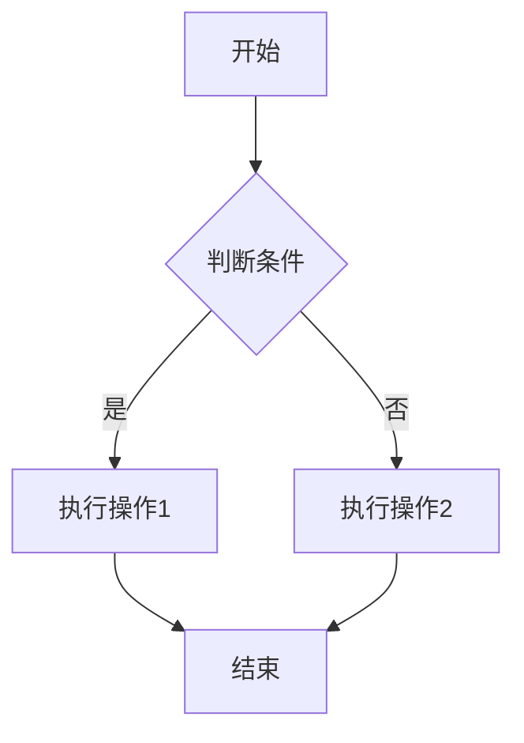
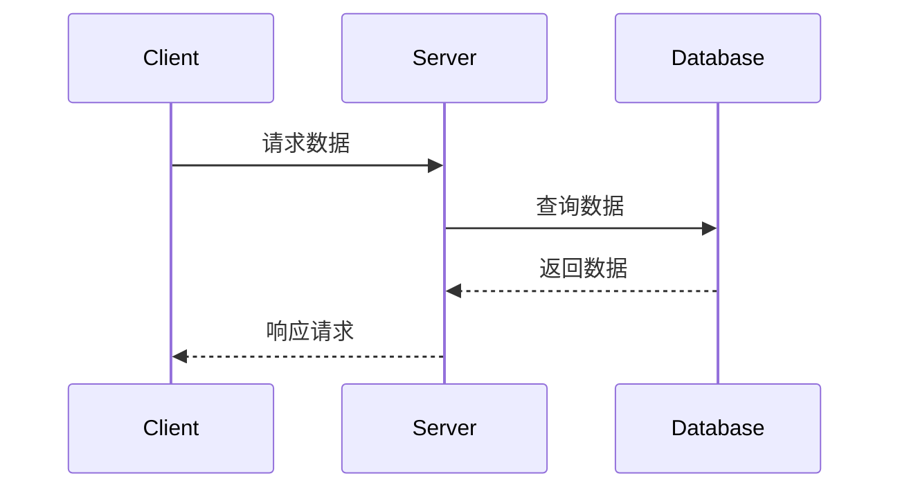
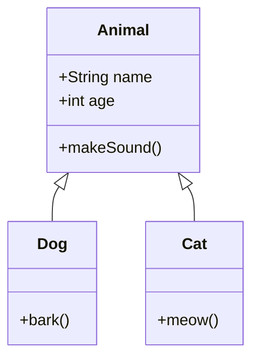
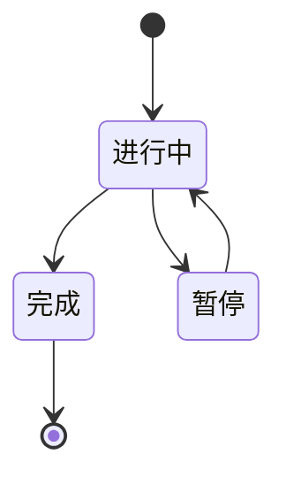
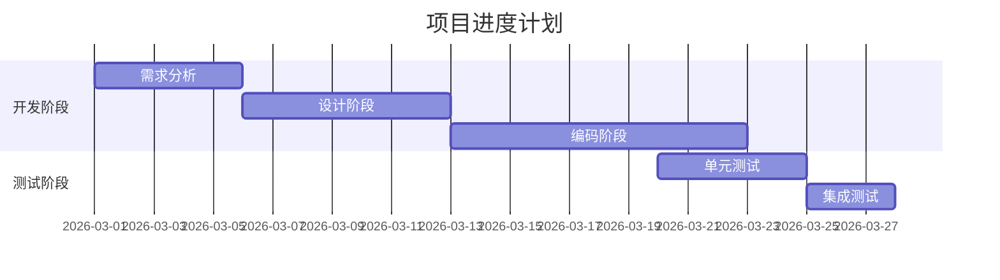

# Markdown测试文档

这是一个用于测试Markdown、Mermaid图表和LaTeX数学公式的示例文章。

## 1. 基础Markdown语法

### 标题
# 一级标题
## 二级标题
### 三级标题

### 文本格式
- **粗体文本**
- *斜体文本*
- ***粗斜体文本***
- ~~删除线文本~~

### 列表
#### 无序列表
- 项目一
- 项目二
  - 子项目1
  - 子项目2
- 项目三

#### 有序列表
1. 第一步
2. 第二步
3. 第三步

### 引用
> 这是一个引用块
> 可以包含多行内容

### 链接和图片
- [Google](https://www.google.com)
- [GitHub](https://github.com)

### 表格
| 列1 | 列2 | 列3 |
|-----|-----|-----|
| 数据1 | 数据2 | 数据3 |
| 数据4 | 数据5 | 数据6 |

### 代码块
```python
def hello_world():
    print("Hello, World!")
    return True
```

```javascript
const greeting = "Hello, World!";
console.log(greeting);
```

## 2. Mermaid图表测试

### 流程图


### 序列图


### 类图


### 状态图


### 甘特图


## 3. LaTeX数学公式测试

### 行内公式
这是一个行内公式示例：$E = mc^2$，这是爱因斯坦的质能方程。

另一个例子：$a^2 + b^2 = c^2$ 是勾股定理。

### 块级公式

#### 二次方程求根公式
$$x = \frac{-b \pm \sqrt{b^2 - 4ac}}{2a}$$

#### 定积分
$$\int_{0}^{\infty} e^{-x^2} dx = \frac{\sqrt{\pi}}{2}$$

#### 傅里叶变换
$$\mathcal{F}\{f(x)\}(\xi) = \int_{-\infty}^{\infty} f(x) e^{-2\pi i x \xi} dx$$

#### 矩阵运算
$$
\begin{bmatrix}
1 & 2 & 3 \\
4 & 5 & 6 \\
7 & 8 & 9
\end{bmatrix}
\times
\begin{bmatrix}
a \\
b \\
c
\end{bmatrix}
=
\begin{bmatrix}
a + 2b + 3c \\
4a + 5b + 6c \\
7a + 8b + 9c
\end{bmatrix}
$$

#### 求和公式
$$\sum_{n=1}^{\infty} \frac{1}{n^2} = \frac{\pi^2}{6}$$

#### 欧拉公式
$$e^{ix} = \cos x + i \sin x$$

#### 偏微分方程
$$\frac{\partial u}{\partial t} = \alpha \frac{\partial^2 u}{\partial x^2}$$

### 复杂公式

#### 麦克斯韦方程组
$$
\begin{aligned}
\nabla \cdot \mathbf{E} &= \frac{\rho}{\varepsilon_0} \\
\nabla \cdot \mathbf{B} &= 0 \\
\nabla \times \mathbf{E} &= -\frac{\partial \mathbf{B}}{\partial t} \\
\nabla \times \mathbf{B} &= \mu_0 \mathbf{J} + \mu_0 \varepsilon_0 \frac{\partial \mathbf{E}}{\partial t}
\end{aligned}
$$

#### 波尔兹曼分布
$$P(i) = \frac{e^{-E_i / k_B T}}{\sum_j e^{-E_j / k_B T}}$$

## 4. 混合使用

这是一个包含代码、公式和图表的综合示例：

### 代码中的数学公式
```python
# 计算圆的面积
import math

radius = 5
area = math.pi * radius ** 2  # A = πr²
print(f"圆的面积是: {area:.2f}")
```

### 流程图 + 公式


$$A = \pi r^2$$

## 5. 表格中的公式

| 公式名称 | 公式 | 说明 |
|---------|------|------|
| 勾股定理 | $a^2 + b^2 = c^2$ | 直角三角形三边关系 |
| 质能方程 | $E = mc^2$ | 质量与能量转换 |
| 牛顿第二定律 | $F = ma$ | 力与加速度关系 |

## 6. 注意事项

1. Mermaid图表使用 ```mermaid 代码块
2. LaTeX公式使用 ```latex 或 ```math 代码块
3. 行内公式使用 $...$ 包裹
4. 所有语法都支持在同一个文档中混合使用

## 7. 音乐乐谱说明

由于ABCjs库已经从GitHub删除，目前暂时无法在网页中直接显示ABC格式的乐谱。

### 可选方案：

1. **使用MuseScore**：将乐谱导出为MuseScore格式（.mscz）或图片
2. **使用在线编辑器**：使用Noteflight等在线乐谱编辑器
3. **手动转换**：将乐谱转换为SVG格式后嵌入

### 示例（使用MuseScore）：

如果您想展示乐谱，可以：
- 使用MuseScore软件编辑乐谱
- 导出为图片（PNG/JPG）
- 在文章中插入图片

---

**最后更新时间**: 2026-03-04
