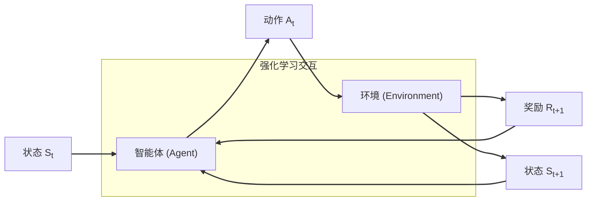

# 强化学习：Q-Learning 算法

强化学习 (Reinforcement Learning, RL) 是机器学习的一个重要分支，它研究智能体 (Agent) 如何在与环境 (Environment) 的交互中，通过“试错”和“奖励反馈”来学习最优行为策略，以最大化其长期累积奖励。与监督学习不同，强化学习不依赖于预设的“标准答案”，而是通过与环境的互动来自主学习。

## 一、强化学习的核心元素

强化学习的场景通常由以下几个核心元素构成：

*   **智能体 (Agent)**：学习和决策的主体，例如一个机器人、一个下棋程序或一个游戏 AI。
*   **环境 (Environment)**：智能体之外的一切，智能体通过传感器感知环境的状态，并通过执行器对环境施加影响。环境可以是物理世界、一个游戏、金融市场等。
*   **状态 (State, S)**：环境在某一刻的状况，它包含了智能体做出决策所需的所有相关信息。
*   **动作 (Action, A)**：智能体在某个状态下可以执行的操作。
*   **奖励 (Reward, R)**：环境在智能体执行动作后，返回给智能体的一个标量信号，用于评价该动作的好坏。智能体的目标是最大化长期累积奖励。
*   **策略 (Policy, π)**：智能体的行为准则，它定义了在给定状态下应采取哪个动作，可以是确定性的 ($a = \pi(s)$) 或随机性的 ($\pi(a|s)$)。



## 二、马尔科夫决策过程 (MDP) 与 Q-Learning

**马尔科夫决策过程 (Markov Decision Process, MDP)** 是对强化学习问题进行形式化描述的数学框架。一个 MDP 可以由一个五元组 $(S, A, P, R, \gamma)$ 完全定义，其中 $S$ 是状态空间，$A$ 是动作空间，$P$ 是状态转移概率，$R$ 是奖励函数，$\gamma$ 是折扣因子。

Q-Learning 是解决 MDP 问题的一种**模型无关 (Model-Free)** 的动态规划方法。它不需要预先知道环境的状态转移概率 $P$ 和奖励函数 $R$，而是通过智能体与环境的交互来学习。其核心思想是学习一个**动作价值函数 $Q(s, a)$**。

### 动作价值函数 Q(s, a)

动作价值函数 $Q_\pi(s, a)$ 衡量的是，在遵循策略 $\pi$ 的前提下，从状态 $s$ 开始并执行动作 $a$ 后，未来所能获得的期望累积折扣奖励。

$$
Q_\pi(s, a) = \mathbb{E}_\pi\left[\sum_{k=0}^{\infty} \gamma^k r_{t+k+1} \Bigg| S_t = s, A_t = a\right]
$$

Q-Learning 的目标是找到**最优动作价值函数 $Q^*(s, a)$**，它代表了在状态 $s$ 下执行动作 $a$ 所能获得的最大期望累积折扣奖励。

$$
Q^*(s, a) = \max_\pi Q_\pi(s, a)
$$

## 三、Q-Learning 核心：贝尔曼最优方程

Q-Learning 的更新规则基于**贝尔曼最优方程**。这个方程揭示了最优 Q 值之间存在的递归关系：一个状态-动作对 $(s, a)$ 的最优 Q 值，等于当前立即获得的奖励 $r$，加上从下一个状态 $s'$ 能获得的最大折扣价值 $\gamma \max_{a'} Q^*(s', a')$。

$$
Q^*(s, a) = \mathbb{E}[r + \gamma \max_{a'} Q^*(s', a')]
$$

## 四、Q-Learning 算法更新公式

Q-Learning 利用贝尔曼方程的思想，通过迭代的方式更新其内部的 Q 表（一个存储 $Q(s, a)$ 值的查找表）。其更新公式如下：

$$
Q(s_t, a_t) \leftarrow Q(s_t, a_t) + \alpha \left[ \underbrace{(r_{t+1} + \gamma \max_{a'} Q(s_{t+1}, a'))}_{\text{TD 目标 (TD Target)}} - \underbrace{Q(s_t, a_t)}_{\text{旧的 Q 值}} \right]
$$

*   $Q(s_t, a_t)$：执行动作前，状态 $s_t$ 和动作 $a_t$ 对应的 Q 值。
*   $\alpha$ (Alpha)：**学习率 (Learning Rate)**，一个介于 0 和 1 之间的超参数，决定了新信息取代旧信息的程度。
*   $r_{t+1}$：执行动作 $a_t$ 后，环境返回的即时奖励。
*   $\gamma$ (Gamma)：**折扣因子 (Discount Factor)**。
*   $\max_{a'} Q(s_{t+1}, a')$：在下一个状态 $s_{t+1}$ 下，所有可能动作 $a'$ 中的最大 Q 值。
*   $[...]$：**时序差分误差 (Temporal Difference Error, TD Error)**，衡量了旧的 Q 值与新观察到的“奖励 + 未来价值”之间的差距。

这个公式的核心在于，它将一个复杂的全局优化问题分解为无数个简单的局部更新步骤，使得智能体能够在探索环境的过程中逐步逼近最优策略。

## 五、代码示例：迷宫中的 Q-Learning

下面，我们将通过一个经典的**迷宫**问题，用 Python 代码来实现 Q-Learning 算法。目标是让智能体从起点 S 到达终点 G，避开障碍物。

### 环境规则

*   **状态 (State)**：智能体在网格中的 `(x, y)` 坐标。
*   **动作 (Action)**：上、下、左、右四个方向。
*   **奖励 (Reward)**：
    *   到达终点 G：+10
    *   触碰障碍物或撞墙：-1
    *   普通移动：-0.1 （鼓励智能体选择更高效的路径）

```python
import numpy as np
import turtle
import time
import random
import matplotlib.pyplot as plt  

class GridWorldConfig:
    def __init__(self):
        self.grid_size = 4
        self.start = (0, 0)
        self.goal = (3, 3)
        self.obstacles = [(1, 1), (2, 2)]
        self.actions = ['up', 'down', 'left', 'right']
        self.num_episodes = 100
        self.max_steps = 100
        self.alpha = 0.1  # 学习率
        self.gamma = 0.9  # 折扣因子
        self.epsilon = 0.1  # 探索率

def get_user_config():
    config = GridWorldConfig()
    
    print("欢迎使用网格世界Q-learning模拟器")
    print("请配置您的网格世界参数（直接回车使用默认值）")
    
    # 网格大小
    size = input(f"网格大小 (默认 {config.grid_size}): ")
    if size.isdigit() and int(size) > 1:
        config.grid_size = int(size)
    
    # 起点
    start = input(f"起点坐标 (格式: x,y 默认 {config.start}): ")
    if start:
        try:
            x, y = map(int, start.split(','))
            if 0 <= x < config.grid_size and 0 <= y < config.grid_size:
                config.start = (x, y)
        except:
            print("输入格式错误，使用默认值")
    
    # 终点
    goal = input(f"终点坐标 (格式: x,y 默认 {config.goal}): ")
    if goal:
        try:
            x, y = map(int, goal.split(','))
            if 0 <= x < config.grid_size and 0 <= y < config.grid_size:
                config.goal = (x, y)
        except:
            print("输入格式错误，使用默认值")
    
    # 障碍物
    obstacles = input(f"障碍物坐标 (格式: x1,y1 x2,y2 ... 默认 {config.obstacles}): ")
    if obstacles:
        obs_list = []
        try:
            for obs in obstacles.split():
                x, y = map(int, obs.split(','))
                if 0 <= x < config.grid_size and 0 <= y < config.grid_size:
                    if (x, y) != config.start and (x, y) != config.goal:
                        obs_list.append((x, y))
            if obs_list:
                config.obstacles = obs_list
        except:
            print("输入格式错误，使用默认值")
    
    # 训练参数
    episodes = input(f"训练回合数 (默认 {config.num_episodes}): ")
    if episodes.isdigit() and int(episodes) > 0:
        config.num_episodes = int(episodes)
    
    steps = input(f"每回合最大步数 (默认 {config.max_steps}): ")
    if steps.isdigit() and int(steps) > 0:
        config.max_steps = int(steps)
    
    alpha = input(f"学习率 (0-1 默认 {config.alpha}): ")
    if alpha and 0 <= float(alpha) <= 1:
        config.alpha = float(alpha)
    
    gamma = input(f"折扣因子 (0-1 默认 {config.gamma}): ")
    if gamma and 0 <= float(gamma) <= 1:
        config.gamma = float(gamma)
    
    epsilon = input(f"探索率 (0-1 默认 {config.epsilon}): ")
    if epsilon and 0 <= float(epsilon) <= 1:
        config.epsilon = float(epsilon)
    
    return config

# 环境类
class GridWorld:
    def __init__(self, config):
        self.grid_size = config.grid_size
        self.start = config.start
        self.goal = config.goal
        self.obstacles = config.obstacles
        self.actions = config.actions
        self.state = self.start
        self.done = False
    
    def reset(self):
        self.state = self.start
        self.done = False
        return self.state
    
    def step(self, action):
        if self.done:
            raise ValueError("Episode has finished")
        
        x, y = self.state
        
        # 执行动作
        if action == 'up' and x > 0:
            x -= 1
        elif action == 'down' and x < self.grid_size - 1:
            x += 1
        elif action == 'left' and y > 0:
            y -= 1
        elif action == 'right' and y < self.grid_size - 1:
            y += 1
        
        # 检查是否碰到障碍物
        if (x, y) in self.obstacles:
            reward = -1
            self.done = True
        # 检查是否到达终点
        elif (x, y) == self.goal:
            reward = 10
            self.done = True
        # 撞墙
        elif self.state == (x, y):
            reward = -1
        # 普通移动
        else:
            reward = -0.1
        
        self.state = (x, y)
        return (x, y), reward, self.done

# 选择动作（ε-贪婪策略）
def choose_action(state, Q, actions, epsilon):
    if random.random() < epsilon:
        return random.choice(actions)
    else:
        x, y = state
        action_idx = np.argmax(Q[x, y])
        return actions[action_idx]

# 绘制环境
def draw_grid(config):
    screen = turtle.Screen()
    screen.title("Q-Learning 网格世界")
    size = 500
    screen.setup(size, size)
    screen.setworldcoordinates(-1, -1, config.grid_size, config.grid_size)
    screen.tracer(0)  
    
    drawer = turtle.Turtle()
    drawer.speed(0)
    drawer.hideturtle()
    
    # 绘制网格
    for i in range(config.grid_size + 1):
        drawer.penup()
        drawer.goto(0, i)
        drawer.pendown()
        drawer.goto(config.grid_size, i)
        
        drawer.penup()
        drawer.goto(i, 0)
        drawer.pendown()
        drawer.goto(i, config.grid_size)
    
    # 标记起点、终点和障碍物
    def draw_square(x, y, color, text=""):
        drawer.penup()
        drawer.goto(x, y)
        drawer.pendown()
        drawer.color("black", color)
        drawer.begin_fill()
        for _ in range(4):
            drawer.forward(1)
            drawer.left(90)
        drawer.end_fill()
        
        if text:
            drawer.penup()
            drawer.goto(x + 0.5, y + 0.5)
            drawer.color("white")
            drawer.write(text, align="center", font=("Arial", max(8, 16 - config.grid_size), "bold"))
            drawer.color("black")
    
    # 绘制起点（绿色方形）
    draw_square(config.start[0], config.start[1], "green", "S")
    # 绘制终点（红色方形）
    draw_square(config.goal[0], config.goal[1], "red", "G")
    # 绘制障碍物（灰色方形）
    for obs in config.obstacles:
        draw_square(obs[0], obs[1], "gray")
    
    return screen, drawer

# 可视化智能体移动
def visualize_agent(drawer, state, grid_size):
    drawer.clear()
    x, y = state
    drawer.penup()
    drawer.goto(x + 0.5, y + 0.5)
    drawer.dot(max(15, 200/grid_size), "blue")

# 显示最优策略
def show_optimal_policy(drawer, Q, config):
    drawer.clear()
    
    # 重绘网格
    for i in range(config.grid_size + 1):
        drawer.penup()
        drawer.goto(0, i)
        drawer.pendown()
        drawer.goto(config.grid_size, i)
        
        drawer.penup()
        drawer.goto(i, 0)
        drawer.pendown()
        drawer.goto(i, config.grid_size)
    
    # 重绘起点、终点和障碍物
    def draw_square(x, y, color, text=""):
        drawer.penup()
        drawer.goto(x, y)
        drawer.pendown()
        drawer.color("black", color)
        drawer.begin_fill()
        for _ in range(4):
            drawer.forward(1)
            drawer.left(90)
        drawer.end_fill()
        
        if text:
            drawer.penup()
            drawer.goto(x + 0.5, y + 0.5)
            drawer.color("white")
            drawer.write(text, align="center", font=("Arial", max(8, 16 - config.grid_size), "bold"))
            drawer.color("black")
    
    draw_square(config.start[0], config.start[1], "green", "S")
    draw_square(config.goal[0], config.goal[1], "red", "G")
    for obs in config.obstacles:
        draw_square(obs[0], obs[1], "gray")
    
    # 绘制最佳路径
    path = find_best_path(Q, config)
    if path:
        path_turtle = turtle.Turtle()
        path_turtle.speed(0)
        path_turtle.hideturtle()
        path_turtle.color("blue")
        path_turtle.width(2)
        
        path_turtle.penup()
        path_turtle.goto(path[0][0] + 0.5, path[0][1] + 0.5)
        path_turtle.pendown()
        
        for step in path[1:]:
            path_turtle.goto(step[0] + 0.5, step[1] + 0.5)

# 根据Q表找到最佳路径
def find_best_path(Q, config):
    path = []
    state = config.start  
    path.append(state)
    visited = set()
    
    for _ in range(config.grid_size * 4):  
        if state == config.goal:  
            break
        if state in visited:  
            return None
        visited.add(state)
            
        x, y = state
        best_action_idx = np.argmax(Q[x, y])
        best_action = config.actions[best_action_idx]
        
        # 执行动作
        if best_action == 'up' and x > 0:
            state = (x - 1, y)
        elif best_action == 'down' and x < config.grid_size - 1:
            state = (x + 1, y)
        elif best_action == 'left' and y > 0:
            state = (x, y - 1)
        elif best_action == 'right' and y < config.grid_size - 1:
            state = (x, y + 1)
        
        # 检查是否碰到障碍物
        if state in config.obstacles:
            return None
            
        path.append(state)
    
    return path if path[-1] == config.goal else None

# 打印Q表
def print_q_table(Q, config, title):
    print(f"\n{title} Q表:")
    action_symbols = {'up': '↑', 'down': '↓', 'left': '←', 'right': '→'}
    
    for x in range(config.grid_size):
        for y in range(config.grid_size):
            if (x, y) in config.obstacles:
                print(f"位置 ({x},{y}): 障碍物")
                continue
            if (x, y) == config.goal:
                print(f"位置 ({x},{y}): 终点")
                continue
            if (x, y) == config.start:
                print(f"位置 ({x},{y}): 起点")
                continue
                
            best_action_idx = np.argmax(Q[x, y])
            best_action = config.actions[best_action_idx]
            
            action_values = [f"{action_symbols[action]}:{Q[x,y,i]:.2f}" 
                           for i, action in enumerate(config.actions)]
            print(f"位置 ({x},{y}): 最佳动作={action_symbols[best_action]}, Q值=[{', '.join(action_values)}]")

# 数据图表
def plot_rewards(rewards, config):
    plt.figure(figsize=(10, 5))
    plt.rcParams['font.sans-serif'] = ['SimHei', 'Microsoft YaHei', 'WenQuanYi Zen Hei', 'sans-serif']  
    plt.rcParams['axes.unicode_minus'] = False  
    window_size = 10
    smoothed_rewards = np.convolve(rewards, np.ones(window_size)/window_size, mode='valid')
    plt.plot(range(1, len(rewards)+1), rewards, 'b-', alpha=0.3, label='原始奖励')
    plt.plot(range(window_size-1, len(rewards)), smoothed_rewards, 'r-', label=f'滑动平均')
    plt.axhline(y=0, color='gray', linestyle='--', alpha=0.5)
    plt.axhline(y=10, color='green', linestyle='--', alpha=0.5, label='目标奖励')
    plt.xlabel('回合数')
    plt.ylabel('奖励')
    plt.title('Q-Learning训练奖励变化曲线')
    plt.legend()
    plt.grid(True, alpha=0.3)
    plt.xlim(0, len(rewards))
    plt.tight_layout()
    plt.show()

# Q-Learning 训练
def q_learning(config):
    # 初始化Q表
    Q = np.zeros((config.grid_size, config.grid_size, len(config.actions)))
    
    env = GridWorld(config)
    screen, drawer = draw_grid(config)
    agent = turtle.Turtle()
    agent.speed(0)
    agent.hideturtle()

    rewards_history = []
    
    # 打印初始Q表
    print_q_table(Q, config, "初始")
    
    for episode in range(config.num_episodes):
        state = env.reset()
        visualize_agent(agent, state, config.grid_size)
        total_reward = 0
        
        for step in range(config.max_steps):
            # 选择动作
            action = choose_action(state, Q, config.actions, config.epsilon)
            action_idx = config.actions.index(action)
            
            # 执行动作
            next_state, reward, done = env.step(action)
            total_reward += reward
            
            # 更新Q表(贝尔曼方程的应用)
            x, y = state
            next_x, next_y = next_state
            best_next_action = np.argmax(Q[next_x, next_y])
            td_target = reward + config.gamma * Q[next_x, next_y, best_next_action]
            td_error = td_target - Q[x, y, action_idx]
            Q[x, y, action_idx] += config.alpha * td_error
            
            # 移动智能体
            visualize_agent(agent, next_state, config.grid_size)
            screen.update()
            time.sleep(0.05)
            
            state = next_state
            
            if done:
                break
        
        # 记录奖励
        rewards_history.append(total_reward)
        print(f"回合: {episode + 1}/{config.num_episodes}, 总奖励: {total_reward:.1f}")
    
    # 打印最终Q表
    print_q_table(Q, config, "最终")
    
    # 显示最优策略和路径
    show_optimal_policy(drawer, Q, config)
    screen.update()
    
    # 显示最佳路径
    path = find_best_path(Q, config)
    if path:
        print("\n找到的最佳路径:")
        print(" → ".join([f"({x},{y})" for x, y in path]))
    else:
        print("\n未能找到有效路径")
    
    # 绘制数据图表
    plot_rewards(rewards_history, config)
    
    #turtle.done()

# 主程序
def main():
    use_custom = input("是否要自定义网格世界配置? (y/n, 默认 n): ").lower() == 'y'
    
    if use_custom:
        config = get_user_config()
    else:
        config = GridWorldConfig()
    
    q_learning(config)

if __name__ == "__main__":
    main()
```

### 代码核心逻辑解析

1.  **`q_learning(config)` 函数**：这是主训练循环。它初始化一个零值的 Q 表 `Q[s, a]`。
2.  **`choose_action(...)` 函数**：实现了**ε-贪婪 (ε-Greedy)** 策略。这个策略是探索与利用的平衡。
    *   以 `epsilon` 的概率进行**探索 (Exploration)**，随机选择一个动作。
    *   以 `1-epsilon` 的概率进行**利用 (Exploitation)**，选择当前 Q 值最高的动作。这确保了智能体既能尝试未知的选项，也能充分利用已学到的知识。
3.  **`for episode...` 循环**：每一次循环代表一次完整的训练回合（从起点到终点或超时）。
4.  **`for step...` 循环**：在每个回合内，智能体一步步地与环境交互。
5.  **`env.step(action)`**：智能体执行动作，环境返回下一个状态、即时奖励和是否结束的标志。
6.  **`Q[s, a]` 更新**：这是 Q-Learning 的核心。代码严格按照 Q-Learning 更新公式执行：
    *   `td_target = reward + config.gamma * Q[next_x, next_y, best_next_action]`：计算 TD 目标。
    *   `td_error = td_target - Q[x, y, action_idx]`：计算 TD 误差。
    *   `Q[x, y, action_idx] += config.alpha * td_error`：使用学习率 `alpha` 更新 Q 值。

通过反复执行这个过程，智能体逐渐学习到在每个状态下，哪个动作能带来最大的长期回报，从而“摸出”通往终点的最优路线。

## 六、Q-Learning 的局限性与拓展

从代码和示例可以看出，Q-Learning 在这种离散、有限的小规模状态空间（4x4网格）中非常有效。它通过一个二维数组 `np.zeros((grid_size, grid_size, n_actions))` 就能完整地存储所有状态-动作对的 Q 值。

然而，这种方法存在明显的局限性——**维度灾难 (Curse of Dimensionality)**。当环境变得复杂，例如棋盘变成 10x10，或者状态不再是简单的坐标，而是连续的像素画面（如玩 Atari 游戏）时，状态空间会呈指数级增长，传统的查找表形式的 Q 表将变得极其庞大，甚至无法存储和更新。

为了解决这个问题，研究人员将 Q-Learning 与**深度神经网络 (Deep Neural Network)** 相结合，诞生了 **DQN (Deep Q-Network)**。DQN 不再使用一个巨大的表格来存储 Q 值，而是用一个神经网络来**拟合** $Q(s, a)$ 函数。网络的输入是状态 $s$（例如游戏画面的像素值），输出是所有可能动作 $a$ 的 Q 值。这样，即使面对海量的状态，神经网络也能通过学习其内在规律，实现对 Q 值的有效泛化，从而解决了传统 Q-Learning 的维度灾难问题。

## 七、总结

Q-Learning 是一种强大的无模型强化学习算法，它通过迭代更新动作价值函数 $Q(s, a)$ 来学习最优策略。其核心在于贝尔曼方程，通过将未来的预期价值与当前的奖励相结合，指导智能体进行学习。尽管存在维度灾难的限制，但其思想是许多现代强化学习算法（如 DQN, Actor-Critic 等）的基石。理解 Q-Learning 是迈向更高级强化学习领域的关键一步。

---

## Q-learning实例：迷宫

我们可以创建一个4×4的迷宫，添加与墙功能相同的障碍物，设置起点和终点，目标是让程序”摸出”最优路线。迷宫规则为：程序智能体碰到墙或障碍物时停留原地并受-1惩罚；到达终点时获得+10奖励并结束当前回合。将智能体位置作为状态，上下左右四个方向作为动作，奖励机制设计为：到达终点+10（目标激励），触碰障碍物/撞墙-1（惩罚错误），普通移动-0.1（鼓励高效路径）。

### 参考代码

```python
import numpy as np
import turtle
import time
import random
import matplotlib.pyplot as plt  

class GridWorldConfig:
    def __init__(self):
        self.grid_size = 4
        self.start = (0, 0)
        self.goal = (3, 3)
        self.obstacles = [(1, 1), (2, 2)]
        self.actions = ['up', 'down', 'left', 'right']
        self.num_episodes = 100
        self.max_steps = 100
        self.alpha = 0.1  # 学习率
        self.gamma = 0.9  # 折扣因子
        self.epsilon = 0.1  # 探索率

def get_user_config():
    config = GridWorldConfig()
    
    print("欢迎使用网格世界Q-learning模拟器")
    print("请配置您的网格世界参数（直接回车使用默认值）")
    
    # 网格大小
    size = input(f"网格大小 (默认 {config.grid_size}): ")
    if size.isdigit() and int(size) > 1:
        config.grid_size = int(size)
    
    # 起点
    start = input(f"起点坐标 (格式: x,y 默认 {config.start}): ")
    if start:
        try:
            x, y = map(int, start.split(','))
            if 0 <= x < config.grid_size and 0 <= y < config.grid_size:
                config.start = (x, y)
        except:
            print("输入格式错误，使用默认值")
    
    # 终点
    goal = input(f"终点坐标 (格式: x,y 默认 {config.goal}): ")
    if goal:
        try:
            x, y = map(int, goal.split(','))
            if 0 <= x < config.grid_size and 0 <= y < config.grid_size:
                config.goal = (x, y)
        except:
            print("输入格式错误，使用默认值")
    
    # 障碍物
    obstacles = input(f"障碍物坐标 (格式: x1,y1 x2,y2 ... 默认 {config.obstacles}): ")
    if obstacles:
        obs_list = []
        try:
            for obs in obstacles.split():
                x, y = map(int, obs.split(','))
                if 0 <= x < config.grid_size and 0 <= y < config.grid_size:
                    if (x, y) != config.start and (x, y) != config.goal:
                        obs_list.append((x, y))
            if obs_list:
                config.obstacles = obs_list
        except:
            print("输入格式错误，使用默认值")
    
    # 训练参数
    episodes = input(f"训练回合数 (默认 {config.num_episodes}): ")
    if episodes.isdigit() and int(episodes) > 0:
        config.num_episodes = int(episodes)
    
    steps = input(f"每回合最大步数 (默认 {config.max_steps}): ")
    if steps.isdigit() and int(steps) > 0:
        config.max_steps = int(steps)
    
    alpha = input(f"学习率 (0-1 默认 {config.alpha}): ")
    if alpha and 0 <= float(alpha) <= 1:
        config.alpha = float(alpha)
    
    gamma = input(f"折扣因子 (0-1 默认 {config.gamma}): ")
    if gamma and 0 <= float(gamma) <= 1:
        config.gamma = float(gamma)
    
    epsilon = input(f"探索率 (0-1 默认 {config.epsilon}): ")
    if epsilon and 0 <= float(epsilon) <= 1:
        config.epsilon = float(epsilon)
    
    return config

# 环境类
class GridWorld:
    def __init__(self, config):
        self.grid_size = config.grid_size
        self.start = config.start
        self.goal = config.goal
        self.obstacles = config.obstacles
        self.actions = config.actions
        self.state = self.start
        self.done = False
    
    def reset(self):
        self.state = self.start
        self.done = False
        return self.state
    
    def step(self, action):
        if self.done:
            raise ValueError("Episode has finished")
        
        x, y = self.state
        
        # 执行动作
        if action == 'up' and x > 0:
            x -= 1
        elif action == 'down' and x < self.grid_size - 1:
            x += 1
        elif action == 'left' and y > 0:
            y -= 1
        elif action == 'right' and y < self.grid_size - 1:
            y += 1
        
        # 检查是否碰到障碍物
        if (x, y) in self.obstacles:
            reward = -1
            self.done = True
        # 检查是否到达终点
        elif (x, y) == self.goal:
            reward = 10
            self.done = True
        # 撞墙
        elif self.state == (x, y):
            reward = -1
        # 普通移动
        else:
            reward = -0.1
        
        self.state = (x, y)
        return (x, y), reward, self.done

# 选择动作（ε-贪婪策略）
def choose_action(state, Q, actions, epsilon):
    if random.random() < epsilon:
        return random.choice(actions)
    else:
        x, y = state
        action_idx = np.argmax(Q[x, y])
        return actions[action_idx]

# 绘制环境
def draw_grid(config):
    screen = turtle.Screen()
    screen.title("Q-Learning 网格世界")
    size = 500
    screen.setup(size, size)
    screen.setworldcoordinates(-1, -1, config.grid_size, config.grid_size)
    screen.tracer(0)  
    
    drawer = turtle.Turtle()
    drawer.speed(0)
    drawer.hideturtle()
    
    # 绘制网格
    for i in range(config.grid_size + 1):
        drawer.penup()
        drawer.goto(0, i)
        drawer.pendown()
        drawer.goto(config.grid_size, i)
        
        drawer.penup()
        drawer.goto(i, 0)
        drawer.pendown()
        drawer.goto(i, config.grid_size)
    
    # 标记起点、终点和障碍物
    def draw_square(x, y, color, text=""):
        drawer.penup()
        drawer.goto(x, y)
        drawer.pendown()
        drawer.color("black", color)
        drawer.begin_fill()
        for _ in range(4):
            drawer.forward(1)
            drawer.left(90)
        drawer.end_fill()
        
        if text:
            drawer.penup()
            drawer.goto(x + 0.5, y + 0.5)
            drawer.color("white")
            drawer.write(text, align="center", font=("Arial", max(8, 16 - config.grid_size), "bold"))
            drawer.color("black")
    
    # 绘制起点（绿色方形）
    draw_square(config.start[0], config.start[1], "green", "S")
    # 绘制终点（红色方形）
    draw_square(config.goal[0], config.goal[1], "red", "G")
    # 绘制障碍物（灰色方形）
    for obs in config.obstacles:
        draw_square(obs[0], obs[1], "gray")
    
    return screen, drawer

# 可视化智能体移动
def visualize_agent(drawer, state, grid_size):
    drawer.clear()
    x, y = state
    drawer.penup()
    drawer.goto(x + 0.5, y + 0.5)
    drawer.dot(max(15, 200/grid_size), "blue")

# 显示最优策略
def show_optimal_policy(drawer, Q, config):
    drawer.clear()
    
    # 重绘网格
    for i in range(config.grid_size + 1):
        drawer.penup()
        drawer.goto(0, i)
        drawer.pendown()
        drawer.goto(config.grid_size, i)
        
        drawer.penup()
        drawer.goto(i, 0)
        drawer.pendown()
        drawer.goto(i, config.grid_size)
    
    # 重绘起点、终点和障碍物
    def draw_square(x, y, color, text=""):
        drawer.penup()
        drawer.goto(x, y)
        drawer.pendown()
        drawer.color("black", color)
        drawer.begin_fill()
        for _ in range(4):
            drawer.forward(1)
            drawer.left(90)
        drawer.end_fill()
        
        if text:
            drawer.penup()
            drawer.goto(x + 0.5, y + 0.5)
            drawer.color("white")
            drawer.write(text, align="center", font=("Arial", max(8, 16 - config.grid_size), "bold"))
            drawer.color("black")
    
    draw_square(config.start[0], config.start[1], "green", "S")
    draw_square(config.goal[0], config.goal[1], "red", "G")
    for obs in config.obstacles:
        draw_square(obs[0], obs[1], "gray")
    
    # 绘制最佳路径
    path = find_best_path(Q, config)
    if path:
        path_turtle = turtle.Turtle()
        path_turtle.speed(0)
        path_turtle.hideturtle()
        path_turtle.color("blue")
        path_turtle.width(2)
        
        path_turtle.penup()
        path_turtle.goto(path[0][0] + 0.5, path[0][1] + 0.5)
        path_turtle.pendown()
        
        for step in path[1:]:
            path_turtle.goto(step[0] + 0.5, step[1] + 0.5)

# 根据Q表找到最佳路径
def find_best_path(Q, config):
    path = []
    state = config.start  
    path.append(state)
    visited = set()
    
    for _ in range(config.grid_size * 4):  
        if state == config.goal:  
            break
        if state in visited:  
            return None
        visited.add(state)
            
        x, y = state
        best_action_idx = np.argmax(Q[x, y])
        best_action = config.actions[best_action_idx]
        
        # 执行动作
        if best_action == 'up' and x > 0:
            state = (x - 1, y)
        elif best_action == 'down' and x < config.grid_size - 1:
            state = (x + 1, y)
        elif best_action == 'left' and y > 0:
            state = (x, y - 1)
        elif best_action == 'right' and y < config.grid_size - 1:
            state = (x, y + 1)
        
        # 检查是否碰到障碍物
        if state in config.obstacles:
            return None
            
        path.append(state)
    
    return path if path[-1] == config.goal else None

# 打印Q表
def print_q_table(Q, config, title):
    print(f"\n{title} Q表:")
    action_symbols = {'up': '↑', 'down': '↓', 'left': '←', 'right': '→'}
    
    for x in range(config.grid_size):
        for y in range(config.grid_size):
            if (x, y) in config.obstacles:
                print(f"位置 ({x},{y}): 障碍物")
                continue
            if (x, y) == config.goal:
                print(f"位置 ({x},{y}): 终点")
                continue
            if (x, y) == config.start:
                print(f"位置 ({x},{y}): 起点")
                continue
                
            best_action_idx = np.argmax(Q[x, y])
            best_action = config.actions[best_action_idx]
            
            action_values = [f"{action_symbols[action]}:{Q[x,y,i]:.2f}" 
                           for i, action in enumerate(config.actions)]
            print(f"位置 ({x},{y}): 最佳动作={action_symbols[best_action]}, Q值=[{', '.join(action_values)}]")

# 数据图表
def plot_rewards(rewards, config):
    plt.figure(figsize=(10, 5))
    plt.rcParams['font.sans-serif'] = ['SimHei', 'Microsoft YaHei', 'WenQuanYi Zen Hei', 'sans-serif']  
    plt.rcParams['axes.unicode_minus'] = False  
    window_size = 10
    smoothed_rewards = np.convolve(rewards, np.ones(window_size)/window_size, mode='valid')
    plt.plot(range(1, len(rewards)+1), rewards, 'b-', alpha=0.3, label='原始奖励')
    plt.plot(range(window_size-1, len(rewards)), smoothed_rewards, 'r-', label=f'滑动平均')
    plt.axhline(y=0, color='gray', linestyle='--', alpha=0.5)
    plt.axhline(y=10, color='green', linestyle='--', alpha=0.5, label='目标奖励')
    plt.xlabel('回合数')
    plt.ylabel('奖励')
    plt.title('Q-Learning训练奖励变化曲线')
    plt.legend()
    plt.grid(True, alpha=0.3)
    plt.xlim(0, len(rewards))
    plt.tight_layout()
    plt.show()

# Q-Learning 训练
def q_learning(config):
    # 初始化Q表
    Q = np.zeros((config.grid_size, config.grid_size, len(config.actions)))
    
    env = GridWorld(config)
    screen, drawer = draw_grid(config)
    agent = turtle.Turtle()
    agent.speed(0)
    agent.hideturtle()

    rewards_history = []
    
    # 打印初始Q表
    print_q_table(Q, config, "初始")
    
    for episode in range(config.num_episodes):
        state = env.reset()
        visualize_agent(agent, state, config.grid_size)
        total_reward = 0
        
        for step in range(config.max_steps):
            # 选择动作
            action = choose_action(state, Q, config.actions, config.epsilon)
            action_idx = config.actions.index(action)
            
            # 执行动作
            next_state, reward, done = env.step(action)
            total_reward += reward
            
            # 更新Q表(贝尔曼方程的应用)
            x, y = state
            next_x, next_y = next_state
            best_next_action = np.argmax(Q[next_x, next_y])
            td_target = reward + config.gamma * Q[next_x, next_y, best_next_action]
            td_error = td_target - Q[x, y, action_idx]
            Q[x, y, action_idx] += config.alpha * td_error
            
            # 移动智能体
            visualize_agent(agent, next_state, config.grid_size)
            screen.update()
            time.sleep(0.05)
            
            state = next_state
            
            if done:
                break
        
        # 记录奖励
        rewards_history.append(total_reward)
        print(f"回合: {episode + 1}/{config.num_episodes}, 总奖励: {total_reward:.1f}")
    
    # 打印最终Q表
    print_q_table(Q, config, "最终")
    
    # 显示最优策略和路径
    show_optimal_policy(drawer, Q, config)
    screen.update()
    
    # 显示最佳路径
    path = find_best_path(Q, config)
    if path:
        print("\n找到的最佳路径:")
        print(" → ".join([f"({x},{y})" for x, y in path]))
    else:
        print("\n未能找到有效路径")
    
    # 绘制数据图表
    plot_rewards(rewards_history, config)
    
    #turtle.done()

# 主程序
def main():
    use_custom = input("是否要自定义网格世界配置? (y/n, 默认 n): ").lower() == 'y'
    
    if use_custom:
        config = get_user_config()
    else:
        config = GridWorldConfig()
    
    q_learning(config)

if __name__ == "__main__":
    main()
```

当然，在原有代码基础上，我对其功能进行了扩展。利用 turtle 库完成了程序运行流程的可视化呈现，通过图形化的界面，我们能够直观的感受程序执行的步骤；以及，对于数据，我利用matplotlib做了数据可视化处理。同时，引入了自定义配置模块，允许用户依据实际需求，对迷宫的规模、障碍物分布等关键参数进行自主设定。


图片展示的是算法训练过程中的最优路径与数据可视化结果。从奖励趋势图可见，训练初期（0~55回合）智能体处于深度探索阶段，因密集障碍物导致奖励持续为负，反映出空间认知的艰难过程；第56回合首次突破至7.9的正奖励，标志着成功发现绕过障碍带的有效路径。此后Q表进入快速优化期，通过贝尔曼方程将终点奖励（+10）反向传播至前驱状态，形成从(0,1)→(5,4)的”价值走廊”。最终200回合训练完成后，关键路径Q值稳定收敛，算法自动规划出唯一最优路径，验证了Q-learning在复杂障碍环境中的路径规划能力。


| 位置坐标 | ↑ (上) | ↓ (下) | ← (左) | → (右) | 价值特征 |
| :--- | :--- | :--- | :--- | :--- | :--- |
| (0,1) | -0.32 | -0.52 | -0.37 | 2.92 | 右移价值主导 |
| (0,2) | -0.19 | 3.75 | -0.33 | -0.23 | 下移价值峰值 |
| (0,3) | -0.27 | 1.32 | -0.27 | -0.34 | 下移局部最优 |
| (1,2) | 0.07 | -0.41 | -0.34 | 4.57 | 右移价值跃升 |
| (1,3) | -0.09 | -0.41 | 0.37 | 5.36 | 右移价值延续 |
| (1,4) | -0.19 | 6.17 | 0.76 | -0.12 | 下移价值突破 |
| (2,4) | 0.86 | 7.00 | -0.19 | -0.34 | 下移价值递增 |
| (3,4) | 1.24 | 7.91 | 0.53 | -0.02 | 接近终点价值 |
| (4,4) | 1.30 | 8.90 | -0.27 | -0.27 | 终点前驱峰值 |
| (5,4) | 0.07 | 0.71 | -0.34 | 10.00 | 终点直达价值 |
| (0,5) | -0.20 | -0.11 | -0.19 | -0.29 | 无显著价值 |
| (3,0) | -0.25 | -0.26 | -0.47 | -0.17 | 低价值区域 |
| (5,0) | -0.23 | -0.30 | -0.30 | -0.22 | 低价值区域 |

以上是Q-learning算法的具体演示。在迷宫环境中，Q-learning通过表格存储每个状态的价值，像背诵固定答案的学生，在4×4等简单迷宫中表现高效，但面对10×10复杂迷宫或更多障碍物时，因Q表维度爆炸和泛化能力缺失而力不从心。

针对这样的问题，我们可以引入神经网络，将Q-learning升级成DQN，让智能体像掌握规律的导航员，能通过经验回放和目标网络机制，从大量数据中提取”靠近目标奖励增加””避开障碍物”等通用法则，不仅能处理任意规模的网格世界，还能快速适应新环境，实现从”死记硬背”到”随机应变”的质变。

接下来，我们尝试为前面的迷宫挑战的Q-learning升级成DQN。前文我们介绍了一堆复杂的公式，说实在的，将那些公式转换成代码非常费脑子，不过好在我们可以尝试利用AI工具辅助我们编程。

经过一次训练后，我获得了以下数据：


显然，在 10×10 这种相对简单的迷宫环境中，DQN 并不能充分展现其优势。在这种情况下，直接使用 Q-learning 算法，或者 A*、Dijkstra 等经典寻路算法，往往就能高效地找到最优解。DQN 的价值更多体现在面对更庞大、更复杂的迷宫（例如状态空间剧增、规则更加多变）时，它相较于Q-learning才更能体现出处理高维状态空间的能力和优势。当然，本代码的主要目标是演示如何用 DQN 解决此类路径规划问题，并验证其基本可行性。

